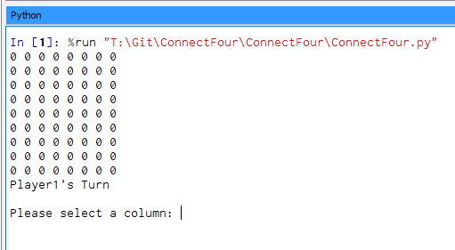

ConnectFour
======
## A Python implementation of ConnectFour. Still incomplete.

#### Screenshot

## Getting Started

### Installation

Run ConnectFour.py to play!

## Contributors

### Contributors on GitHub
* [Anthony Nguyen](https://github.com/resolutedreamer)

### Third party libraries
* None Used

## License 
* This project is licensed under the Apache License - see the [LICENSE.md](https://github.com/resolutedreamer/BLE_UART_8001/blob/master/LICENSE) file for details

## Version 
* Version 0.85

## Contact
#### Anthony Nguyen
* Homepage: www.resolutedreamer.com

Last Updated 2016/10/27
